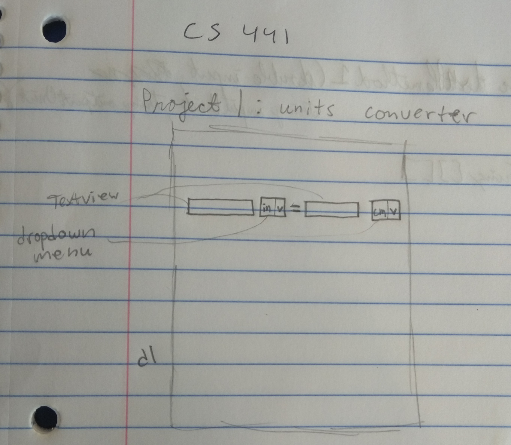
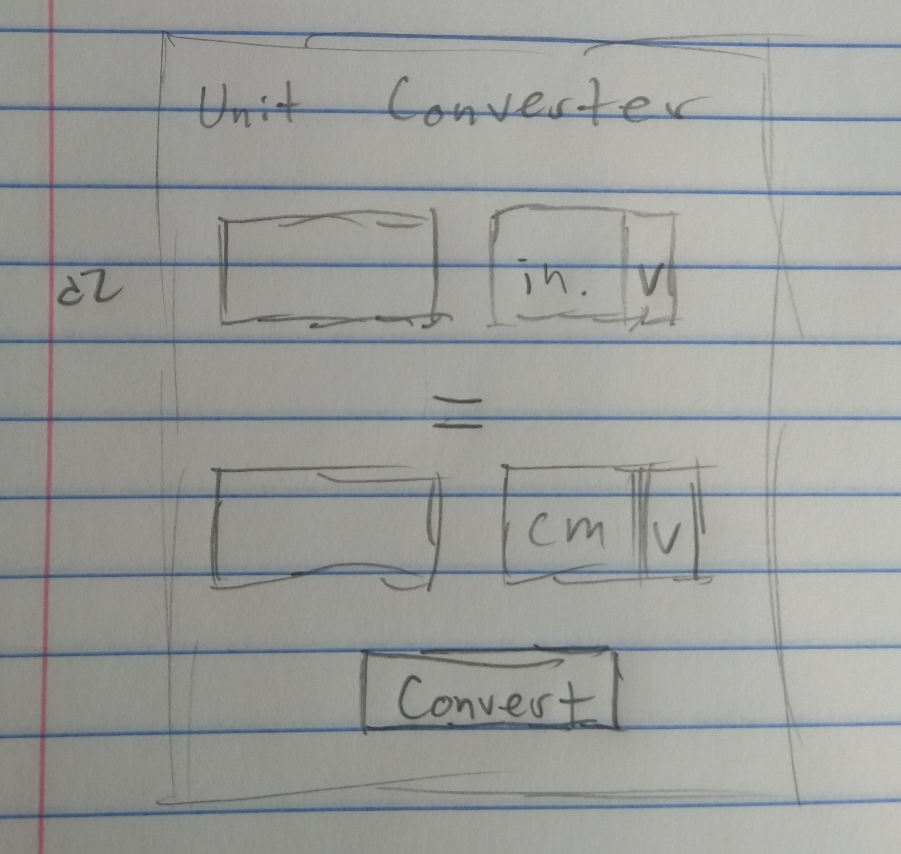

# Unit-Converter
Unit converter android app created by Kyle Hanson.

The Unit Converter app receives an input value from the user, along with specified units selected from a dropdown menu. Afterwards, the user selects the units to be converted to from another dropdown menu. While you can choose any of the available units in the input unit dropdown menu, the output unit dropdown menu only displays those that are related to the input unit selected. For example, units of length (in) will be able to be converted to other units of length (ft, yd, cm, etc.), but won't display unconvertable units like units of temperature or volume. Once the "Convert" button is pressed, the output value changes from blank to the converted value using the conversion formula between the two units. 

When designing the app layout itself, I switched from the overly compact design labeled as d1 (notice the lack of a button, implying the conversion was going to be instant, but I concluded this wouldn't be the most practical)

and switched to the more aesthetically pleasing design labeled as d2.

The most challenging part was getting familiar with Android Studio. I had to learn how to use certain classes and the documentation associated with them so I could use its methods properly. I used the Spinner object for the first time in this application. It was difficult to find a way to make do specifically what I want it to do (make the output unit Spinner depend on the selected unit in the input unit Spinner), but, nonetheless, I was able to find workarounds to these complications. The actual conversion logic between units took the longest to program. It wasn't difficult to program, just time consuming. Each unit needed a switch statement for a conversion for EACH of the related units.

I tried going above and beyond in this project by adding as multitude of different units as well as types of units (length, weight, temperature, speed, time, and volume). With this abundance of different data types, I thought of the idea to make the output unit Spinner to be dependent on the input unit. A difficulty I ran into was converting between units that are vastly different in terms of size/precision. For this reason, I chose to eliminate nanoseconds, milliseconds, years, centuries, and milleniums to keep the range fairly close--the amount of nanoseconds in a millenium is too large to be contained in a double if that wasn't obvious.

**Coding Log**

**8/30**
- Started project
- Started design layout
- (GitHub wasn't properly setup so I had to create a new repo on 9/4)

//Explanation for potential lack of productivity between this time: CS 301 paper

**9/4**
- Solid design layout to work with

**9/7 (Morning)**
- Setup input spinner with units
- Slight design modifications

**9/7 (Night)**
- Setup output spinner
  - contains units related to input unit
  
**9/7 (Late late night) - 9/8 (Early early morning)**
- Spontaneous, 3-hour, late-night coding session
  - finished conversion logic
  - finished programming button to display conversion in the output value TextView
  - fixed warnings about hardcoded strings and autofillHints
  - made custom app logo design:
  

